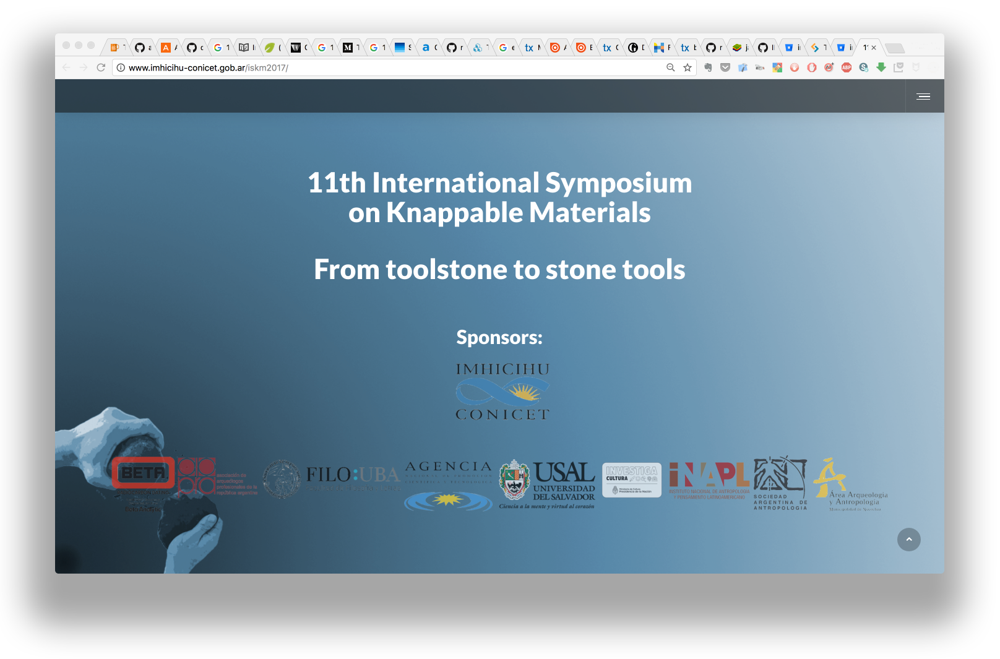

# Rationale #

* This document is related to the [website](http://www.imhicihu-conicet.gob.ar/iskm2017/) of ISKM 2017. 
* The (internal) source and commits & the workflow _et alia_ is not shared on behalf of security (up to now). 

### What is this repository for? ###

* Worflow in the making of [http://www.imhicihu-conicet.gob.ar/iskm2017/](http://www.imhicihu-conicet.gob.ar/iskm2017/) webapps, mobile content, etc.
* Version 1.3

### How do I get set up? ###

* Summary of set up
     - an Apache server. A _legit_ CPanel account. A CMS to install. 
* Dependencies
     - _the less, the better_. A personal [motto](http://dictionary.cambridge.org/es/diccionario/ingles/motto)
* Database configuration
     - the same CMS provides an inner control- self-automatic system. A weekly backup is done for third-parties to prevent corruption but mostly for *security* reasons. A monthly backup is programmed via Cpanel (FTP or via internal File Manager)
* How to run tests
     - No data is provided. From the beginning to the final of this project, some privacy & security issues must be fulfilled.
* Deployment instructions
     - This repo is a project related with a [symposium](http://www.imhicihu-conicet.gob.ar/iskm2017/). So, this _rationale_ begins and ends with it.

### Contribution guidelines ###

* Code review
     - For *security* reasons, there is no code to share. 
     - What it can be shared can be found in the [Downloads](downloads/) or [Source](https://bitbucket.org/imhicihu/iskm2017/src) section.

### Legal ###

* All trademarks are the property of their respective owners.

### License ###

* The content of this project itself is licensed under the 